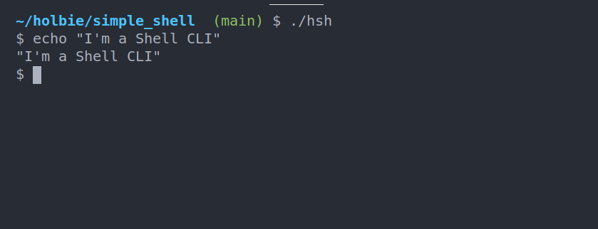

# simple_shell


[](https://travis-ci.org/joemccann/dillinger)

Description

This is Unix Shell project Command Line Interface for Linux systems. This Shell can interpretate instructions and perform Syscall or instruction.



## Features
- Find commands in the PATH
- Print environment
- execute commands with parameters


### Built-ins

Built-ins are custom Commands in Shell
- **env** print current environment
- **exit** close the shell.

##  Allowed functions and system calls
| Project      | Description              |
| ------------ | ------------------------ |
| **access**   | (man 2 access)           |
| **chdir**    | (man 2 chdir)            |
| **close**    | (man 2 close)            |
| **closedir** | (man 3 closedir)         |
| **execve**   | (man 2 execve)           |
| **exit**     | (man 3 exit)             |
| **_exit**    | (man 2 _exit)            |
| **fflush**   | (man 3 fflush)           |
| **fork**     | (man 2 fork)             |
| **free**     | (man 3 free)             |
| **getcwd**   | (man 3 getcwd)           |
| **getline**  | (man 3 getline)          |
| **getpid**   | (man 2 getpid)           |
| **isatty**   | (man 3 isatty)           |
| **kill**     | (man 2 kill)             |
| **malloc**   | (man 3 malloc)           |
| **open**     | (man 2 open)             |
| **opendir**  | (man 3 opendir)          |
| **perror**   | (man 3 perror)           |
| **read**     | (man 2 read)             |
| **readdir**  | (man 3 readdir)          |
| **signal**   | (man 2 signal)           |
| **stat**     | (__xstat) (man 2 stat)   |
| **lstat**    | (__lxstat) (man 2 lstat) |
| **fstat**    | (__fxstat) (man 2 fstat) |
| **strtok**   | (man 3 strtok)           |
| **wait**     | (man 2 wait)             |
| **waitpid**  | (man 2 waitpid)          |
| **wait3**    | (man 2 wait3)            |
| **wait4**    | (man 2 wait4)            |
| **write**    | (man 2 write)            |

## Usage

Download Shell Repo
```
$ git clone  https://github.com/williamzborja/simple_shell
```

The flags for correct compilation
```
gcc -Wall -Werror -Wextra -pedantic --std=c89 -o hsh
```

### Test Output

#### Interactive mode:
```sh
$| ./hsh
$ ls
AUTHORS            prompt.c   shell.h            _strtok.c          command_execute.c   man_sh  README.md
$ exit
```

#### Non-interactive mode:

```sh
$ echo "ls" | ./hsh
AUTHORS            prompt.c   shell.h            _strtok.c          command_execute.c   man_sh  README.md
```


## Files
| Project                                        | Description                          |
| ---------------------------------------------- | ------------------------------------ |
| [_which.c](./_which.c)                         | Read PATH environment variable       |
| [built_in_functions.c](./built_in_functions.c) | Shell Built-in functions             |
| [execute.c](./execute.c)                       | Execution with fork and without fork |
| [header.h](./header.h)                         | Header Library                       |
| [prompt](./prompt.c)                           | Display Prompt                       |
| [shell.c](./shell.c)                           | Entrypoint of Shell                  |
| [string.c](./shell.string.c)                   | Strings Manipulations                |
| [string_2.c](./shell.string_2.c)               | Strings Manipulations                |

## AUTHORS
:woman:  :man:  :man: :computer:

Adriana Echeverri Romero, Oscar Angel, William Andres Rodriguez Borja
